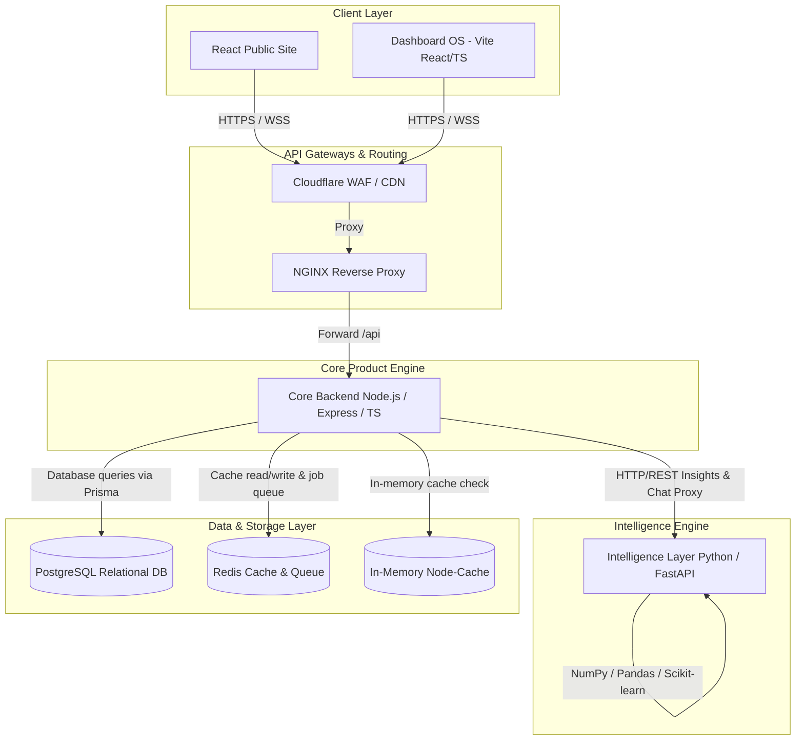

# Kangqore: Complete System Design Document

This document provides a comprehensive overview of the current system architecture of the **Kangqore Platform**, analyzes its present capabilities, and outlines a concrete roadmap for future enterprise-grade scaling.

---

## 🏛️ 1. Architecture Overview (Dual-Backend Model)

Kangqore is designed around a modern **Dual-Backend separation of concerns** model. This divides simple REST-based product operations from resource-heavy machine learning and analytics engines.



### Component Analysis

| Component | Port | Primary Tech Stack | Core Responsibilities |
| :--- | :--- | :--- | :--- |
| **Frontend (Public React App)** | `3000` | React, CRA, Tailwind CSS, Lucide | Customer-facing landing pages, public resources, lead generation forms, and marketing flows. |
| **Dashboard OS (Vite React/TS)** | `5173` | React 18, Vite, TypeScript, Radix UI, TanStack Query | Highly-optimized internal enterprise control panel for managing projects, invoices, deliverable states, and eQORE AI tools. |
| **Core Backend (Product Engine)** | `5050` / `3001` | Node.js, Express, TypeScript, Prisma ORM | Auth (JWT), CRUD controllers for business entities, schema migrations, and secure gateway proxying to the Python layer. |
| **Intelligence Layer (AI Engine)** | `8000` | Python, FastAPI, Pandas, NumPy, Scikit-learn | Computationally expensive operations: analytical aggregations, real-time AI recommendation models, and semantic chat processing. |
| **Database & Caching** | `5432` / `6379` | PostgreSQL 15, Redis 7, Local Memory Cache | Persistent relational storage, distributed transient caching, local service caching, and API rate-limiting trackers. |

---

## 💾 2. Data & Cache Architecture

### A. The Relational Core (PostgreSQL + Prisma)
Kangqore maintains a heavily normalized, enterprise-scale relational schema consisting of several key domain entities.
*   **User & Session management:** Full-featured RBAC system (Admin, Client, Manager roles) with secure password hashing, tokens, and active audit fields.
*   **Operational Management:** Complex relationships linking `Clients` ➡️ `Projects` ➡️ `Deliverables` ➡️ `Tasks`.
*   **Financial Flow:** Full accounting entity mappings including `Invoices`, `Payments`, and `ChangeRequests` with strong constraints and cascaded deletions.

### B. Tiered Caching Strategy
To maintain low latency and manage db connection load, Kangqore employs a **Three-Tiered Cache Architecture**:

1.  **Tier 1: Node-Cache (In-Memory Local Cache)**
    *   *Where:* Implemented in `cache.service.ts` at the Node.js application layer.
    *   *Role:* Extremely fast cache (microseconds) for slow-changing static metadata (e.g., system configuration options, category lookups).
2.  **Tier 2: Redis Service (Distributed Cache)**
    *   *Where:* Implemented in `eqore/routing/routingCache.service.ts` in the core engine.
    *   *Role:* Persistent, shared-memory cache enabling multi-instance API speedups and key-value state persistence across restarts.
3.  **Tier 3: Database Indexing**
    *   *Where:* PostgreSQL schema layer.
    *   *Role:* Heavily indexed foreign keys and unique constraints to expedite non-cached complex query execution.

---

## 🔒 3. Current Security Infrastructure (What is Available)

Your application already implements several robust security measures standard in modern web backends:

```
[Incoming Request] ──► [3-Layer Rate Limiter] ──► [CORS Whitelist Filter] ──► [Helmet Security Headers] ──► [Zod/Joi Input Validation] ──► [Controller Exec]
```

*   **Rate Limiting:** Protects endpoints from brute-force and DDoS attacks.
*   **Helmet.js Integration:** Automatically sets critical HTTP security headers (e.g., `X-Content-Type-Options`, `X-Frame-Options`, `Content-Security-Policy`).
*   **CORS Configuration:** Prevents cross-origin scripting attacks via strict domain-whitelisting in Express.
*   **Input Sanitization:** Uses validation middleware (Zod/Joi) to reject malformed JSON, SQL-injection patterns, or oversized payloads before execution.

---

## 🚀 4. Scaling Architecture (What SHOULD Be Implemented)

To transform Kangqore from a startup MVP to an enterprise-grade platform capable of handling millions of requests with 99.99% availability, we recommend implementing the following high-priority production changes:

### A. Cloudflare WAF & Global CDN Setup (Edge Security)
Instead of serving static assets (`/uploads`, compiled React bundles) directly through the Node.js Express process, offload this work to the edge.

*   **Action Plan:**
    1.  Point the production domain DNS (e.g., `kangqore.com`) to Cloudflare.
    2.  Activate the **Cloudflare Free WAF** to automatically block SQL injections, XSS attacks, and bot scanners at the network edge.
    3.  Implement **Cloudflare CDN** caching rules for compiled frontend assets.
    4.  Store user uploads in a cloud object store (e.g., AWS S3 or Cloudflare R2) and serve them using a Cloudflare CDN subdomain (e.g., `assets.kangqore.com`).

### B. Distributed Database Architecture (Aligning to CAP Theorem)
To ensure high availability and partition tolerance, transition from a single-node PostgreSQL instance to a clustered database configuration.

```
                  ┌──────────────────────────────┐
                  │      Prisma Client (Node)    │
                  └──────────────┬───────────────┘
                                 │
                 ┌───────────────┴───────────────┐
                 │    Connection Pooler (PgBouncer)│
                 └───────────────┬───────────────┘
                                 │
                 ┌───────────────┴───────────────┐
                 │      Prisma Read/Write Split  │
                 └──────┬─────────────────┬──────┘
                        │ (Writes Only)   │ (Reads Only)
                        ▼                 ▼
             ┌────────────────────┐   ┌────────────────────┐
             │ PostgreSQL Primary │──►│ PostgreSQL Replica │
             │     (Read/Write)   │   │     (Read-Only)    │
             └────────────────────┘   └────────────────────┘
```

*   **Strategy:**
    *   Use a managed PostgreSQL solution (like AWS RDS Aurora or Supabase) with **Multi-AZ enabled**.
    *   Utilize **Read-Replicas** and configure Prisma to perform read/write splitting:
        *   All writes go directly to the primary node (**guaranteeing strong consistency for finance/accounts**).
        *   Heavy analytical reads are distributed across read-replicas (**guaranteeing high availability**).

### C. Message Broker & Async Background Tasks
Currently, if an API needs to perform a heavy task (e.g., sending system emails, generating PDF invoices, computing recommendation matrices), it can tie up the Express event loop.

*   **Action Plan:**
    *   Introduce **BullMQ** (a Redis-backed distributed task queue) into the Node.js service.
    *   Offload background processes to decoupled background workers:
        ```typescript
        // In the Express controller, quickly queue the job and return immediately:
        await invoiceQueue.add('generate-pdf', { invoiceId });
        ```
    *   This ensures the API remains incredibly fast and responsive under load.

### D. Advanced CI/CD & Staging Pipeline
Transitioning code straight to production is a high risk. Implement a standard staging-branch development pipeline:

```
  Feature Branch 
        │
        ▼ (PR review + GitHub Actions lint/test)
  main branch (Automatically deploys to Staging: staging.kangqore.com)
        │
        ▼ (Manual smoke tests / client approval)
  Release Tag / production branch (Deploys to Prod: kangqore.com)
```

*   **Implementation:**
    1.  Create separate `.env.staging` and `.env.production` profiles.
    2.  Write a GitHub Actions workflow to run Prisma migrations, run standard Jest unit tests, and deploy using Docker-compose, PM2, or Firebase App Hosting.

---

## 📊 5. Architecture Summary Table

| Operational Area | Current Status (Pre-Prod) | Target Status (Enterprise Scale) | Impact |
| :--- | :--- | :--- | :--- |
| **Reverse Proxy** | None (Express serves assets directly) | **NGINX / Cloudflare Edge** | Offloads static assets; improves TLS handshake times; hides origin IP. |
| **DB Setup** | Single-Node PostgreSQL (Localhost) | **PostgreSQL Cluster (Primary + Read Replicas)** | Eliminates single-point-of-failure; scales read capacity by 10x. |
| **Cache Tiering** | Active (Local Node-Cache + Redis Service) | **Clustered Redis + Session Storage** | Ensures cache state is shared across auto-scaled API containers. |
| **AI Processing** | Synchronous REST Calls | **Async API with BullMQ & Status Polls** | Prevents API timeout during deep analytical calculations. |
| **Deployments** | Direct scripts (`npm run dev`) | **Git-driven CI/CD (GitHub Actions + Staging Env)** | Ensures zero-downtime rolling updates and prevents broken production code. |
